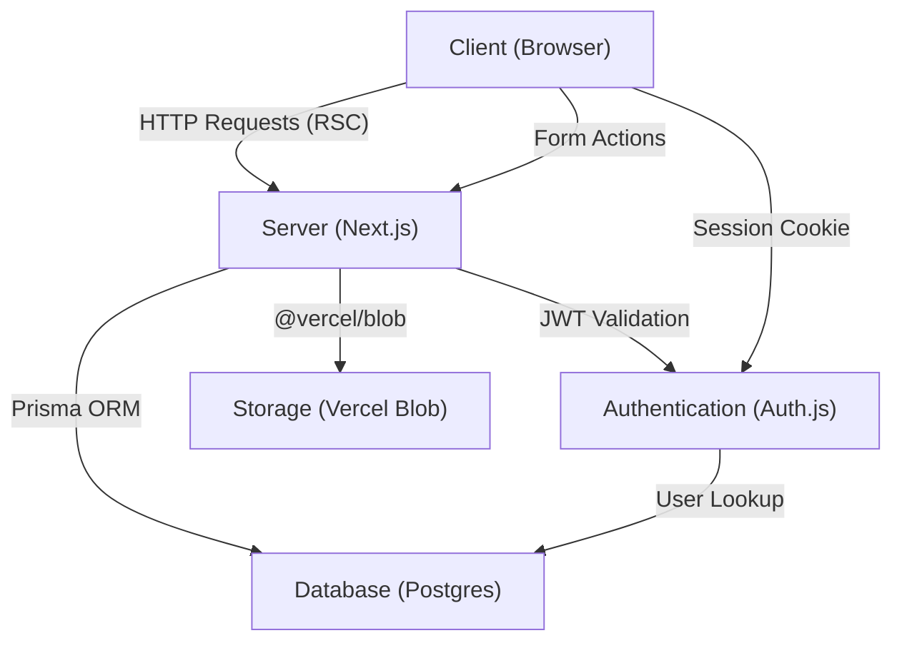

# Technical High-Level Design (HLD)

This document outlines the technical architecture, data flows, and interactions between the client, server, and database for the Elite Estate platform.

---

## 1. System Architecture

The application is built using a **Modern Full-Stack Architecture** powered by Next.js. It follows a "Hub-and-Spoke" model where the Next.js Server acts as the central coordinator.

---

## 2. Core Components

### A. Frontend (Client Utility)
- **React Server Components (RSC)**: Fetch data directly on the server to minimize client-side JavaScript.
- **Next.js Server Actions**: Securely handle user interactions (forms, button clicks) without traditional API endpoints.
- **Lucide Icons**: Provide a consistent and premium visual language.

### B. Backend (Server Logic)
- **NextAuth.js (v5)**: Handles identity management, session tracking, and role-based access control (RBAC). 
- **Prisma Client**: An auto-generated query builder that provides type-safe access to the database.
- **Edge Middleware**: Ensures only authenticated users can access protected routes like the Dashboard.

### C. Data & Storage
- **PostgreSQL**: Stores relational data including Users, Properties, KYC Profiles, and Shortlists.
- **Vercel Blob**: A high-performance object store for KYC documents and property images.

---

## 3. Key Interaction Flows

### User Login & Security
1. **Request**: User enters credentials.
2. **Logic**: `auth.ts` calls `prisma` to find the user and `bcrypt` to verify the password.
3. **Session**: A JWT is signed and set as a secure server-only cookie.
4. **Middleware**: On every subsequent page load, `middleware.ts` checks the JWT to allow/deny access.

### Property Submission
1. **UI**: User fills out the "List Property" form and selects images.
2. **Action**: `createProperty` (Server Action) receives the `FormData`.
3. **Storage**: Images are streamed directly to **Vercel Blob**.
4. **DB**: The resulting URLs and property details are saved via **Prisma** transaction.
5. **UI Update**: `revalidatePath` is called to refresh the dashboard immediately.

### KYC Verification
1. **Upload**: User uploads a government ID (Vercel Blob).
2. **Pending**: Database marks the user's `kycStatus` as `PENDING`.
3. **Admin Review**: A Verification Team member sees the document URL.
4. **Outcome**: Admin approves, and the User's role or status is updated within a single Prisma transaction.

---

## 4. Technology Stack Summary

| Layer | Technology |
| :--- | :--- |
| **Framework** | Next.js 15+ (App Router) |
| **Language** | TypeScript |
| **Database** | PostgreSQL |
| **ORM** | Prisma |
| **Auth** | NextAuth.js v5 (Auth.js) |
| **Styling** | Vanilla CSS (Modern CSS Variables) |
| **Storage** | Vercel Blob |
| **Hosting** | Vercel (Production) |

---

## 5. Security Principles
- **Sensitive Data Isolation**: PII (Personally Identifiable Information) like KYC documents are stored in secure cloud buckets, not on the server disk.
- **Role-Based Access**: Route protection is enforced at the edge (middleware) and verified again at the component level.
- **Environment Safety**: Credentials and tokens (like `AUTH_SECRET`) are never hardcoded and are managed via encrypted environment variables.
